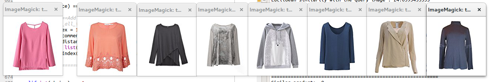
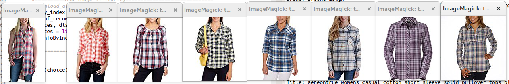
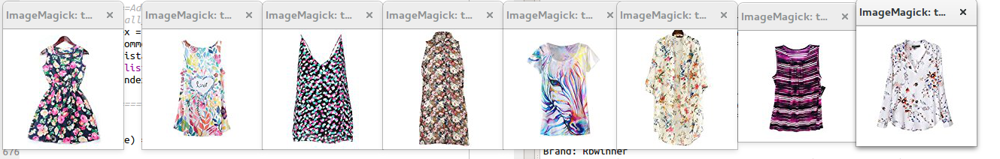

# Recommender-system
A basic approch from NLP and Computer vision to get list of similar products on clothes dataset from amazon api. 
Text and image analysis are performed to get high level features.

## Text analysis
Text analysis on title, brand and color with the help of following model
- Baggage of words
- tf-idf
- word2vec
- word2vec*idf

## Image analysis.
- data from last flatten layer of VGG16 is considered because it was able to recognize pattern/small object from clothes.

On the basis of euclidean distance between numerical features between queried product and remaining products, similar products are found out.

## Some results
First one is query image and rest are recommendations
 
 
 
 
 
 

